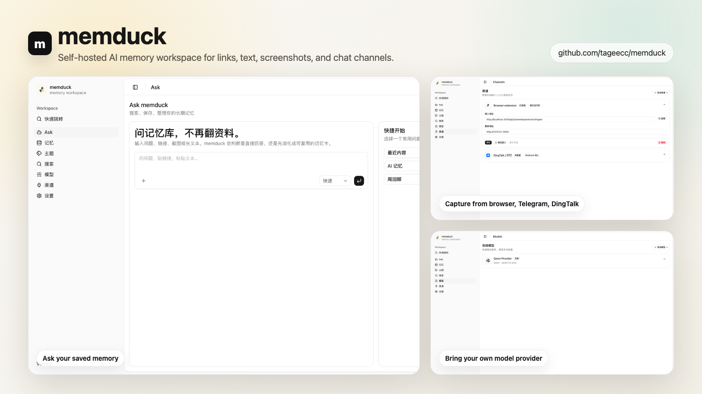

<div align="center">


# memduck

**Self-hosted AI memory workspace for links, text, screenshots, and chat channels**

[](https://github.com/tageecc/memduck/blob/main/LICENSE)
[](https://github.com/tageecc/memduck/stargazers)
[](https://www.npmjs.com/package/memduck)

[Quick Start](#quick-start) · [Features](#core-features) · [How It Works](#how-it-works) · [Docs](#docs)

</div>

---

## Screenshots

<div align="center">
  
  <p><em>Ask your saved memory, capture from browser and chat channels, and configure model providers in one local workspace.</em></p>
</div>

---

## Core Features

- **Memory Cards** — Save links, copied text, screenshots, and channel messages into reusable cards with original source traceability.
- **Grounded Q&A** — Ask questions against saved memory with citations back to source spans, not generic model recall.
- **Self-Hosted Runtime** — Run one local Next.js app with SQLite storage, local file assets, and explicit provider configuration.
- **Browser Capture** — Use the Manifest V3 extension to send current pages or selected text into memduck.
- **Channel Center** — Connect Telegram, browser extension, DingTalk, Slack, Discord, Feishu, WhatsApp, and catalog channels from the UI.
- **Model Provider Catalog** — Configure OpenAI, Anthropic, Gemini, Ollama, OpenAI-compatible profiles, and other hosted/local providers.
- **Background Compilation** — Keep topic summaries, review buckets, embeddings, and reranking data compiled outside the render path.

---

## Quick Start

### Install from npm

```bash
npm install -g memduck@latest
memduck
```

Run the web runtime together with Telegram:

```bash
memduck --with-telegram
```

The packaged runtime stores config and SQLite state under `~/.memduck` by default.

### Run from source

**Prerequisites**

- Node.js 24+
- [pnpm](https://pnpm.io)

```bash
git clone https://github.com/tageecc/memduck.git
cd memduck
pnpm install
pnpm memduck dev
```

Run the web app, worker, and Telegram bot together:

```bash
pnpm memduck dev --with-telegram
```

Open [http://127.0.0.1:3000/ask](http://127.0.0.1:3000/ask) to start using the workspace.

Before opening the browser, you can run a local readiness check:

```bash
pnpm memduck doctor
```

Set `MEMDUCK_HOME` if you want runtime data somewhere other than `~/.memduck/runtime`.

---

## Features

<details>
<summary><strong>Capture & Ingestion</strong></summary>

<br/>

- Save URLs, pasted text, screenshots, and chat/channel messages.
- Preserve raw source content so every summary can be traced back.
- Use the browser extension popup to send the current page or selected text to `/api/ingest`.
- Use the same ingestion API across native channels and webhook adapters.

</details>

<details>
<summary><strong>AI Memory Retrieval</strong></summary>

<br/>

- Embed ready cards when the active provider profile includes an embedding model.
- Chunk source text so citations can point to original spans.
- Perform semantic retrieval over stored cards, then rerank candidates before answering.
- Persist topic links with confidence and reasoning for explainable grouping.

</details>

<details>
<summary><strong>Channels</strong></summary>

<br/>

- Native local runtimes: Web, browser extension, Telegram.
- Webhook ingestion adapters: DingTalk, Slack, Discord, Feishu, WhatsApp.
- OpenClaw-style channel catalog for configuring and tracking broader channel options.
- Runtime diagnostics and heartbeat status inside `/channels`.

</details>

<details>
<summary><strong>Model Providers</strong></summary>

<br/>

- Built-in provider library modeled after OpenClaw-style provider catalogs.
- Configure OpenAI, Anthropic, Gemini, Ollama, OpenAI-compatible profiles, and other hosted/local providers.
- Activate one provider profile for the current runtime.
- Test provider readiness from the web UI before relying on retrieval or chat.

</details>

<details>
<summary><strong>Review & Knowledge Compilation</strong></summary>

<br/>

- Background worker compiles topic summaries and review buckets.
- Users can star, highlight, and queue cards for review.
- Memory weighting is visible through explicit signals rather than only hidden ranking heuristics.
- Topic and review data power retrieval and memory detail pages without becoming mandatory top-level surfaces.

</details>

---

## How It Works

```text
┌──────────────────┐     ┌──────────────────┐     ┌──────────────────┐
│ Browser / Chats  │────▶│  Ingestion API   │────▶│ SQLite + Assets  │
└──────────────────┘     └──────────────────┘     └──────────────────┘
          │                        │                        │
          ▼                        ▼                        ▼
┌──────────────────┐     ┌──────────────────┐     ┌──────────────────┐
│ Channel Center   │     │ Compiler Worker  │────▶│ Embeddings/Topics│
└──────────────────┘     └──────────────────┘     └──────────────────┘
                                   │                        │
                                   ▼                        ▼
                         ┌──────────────────┐     ┌──────────────────┐
                         │    Ask Agent     │────▶│ Cited Answers    │
                         └──────────────────┘     └──────────────────┘
```

1. **Capture** — Browser extension, Telegram, DingTalk, Slack, Discord, Feishu, WhatsApp, and web inputs send content into the same local API.
2. **Normalize** — memduck stores raw source, generated card summaries, local assets, provider settings, and channel state in the local runtime.
3. **Compile** — The worker creates embeddings, topic links, topic summaries, and review buckets in the background.
4. **Ask** — The Agent retrieves relevant memory, reranks candidates, and answers with citations to saved source material.

---

## Tech Stack

| Layer | Technology |
|-------|------------|
| Web App | Next.js 16, React 19, TypeScript |
| UI | Tailwind CSS, shadcn/ui, Radix UI, lucide-react |
| AI SDK | Vercel AI SDK, Streamdown |
| Storage | SQLite, better-sqlite3, local file assets |
| Channels | Manifest V3 extension, grammY Telegram bot, webhook adapters |
| Runtime | Node.js 24+, packaged CLI |
| Testing | Vitest, TypeScript, Biome |

**Key implementation details**

- One local runtime root under `~/.memduck` by default.
- Provider-backed embeddings plus reranking for grounded retrieval.
- Channel heartbeat APIs for browser-visible runtime diagnostics.
- Packaged npm CLI that can launch without a separate source build.

---

## Product Map

- `/ask` — Agent workspace for questions, links, text, screenshots, and memory creation.
- `/inbox` — Memory library for saved cards.
- `/memory/:id` — Memory detail view with explicit signal actions and traceability.
- `/models` — Provider and model configuration.
- `/channels` — Web, extension, Telegram, DingTalk, Slack, Discord, Feishu, WhatsApp, and catalog channel configuration.
- `/setup` — Language and theme preferences.

---

## Browser Extension

Build the unpacked extension:

```bash
pnpm extension:build
```

Load `extension/dist` as an unpacked Chrome extension. The popup lets you set your local app URL and send the current page or selected text into `/api/ingest`.

The extension also pings memduck on open, syncs its base URL from the channel center when possible, and reports heartbeat status back to `/channels`.

---

## Telegram & Channel Adapters

Save the Telegram bot token in `/channels`, or set `TELEGRAM_BOT_TOKEN`, then run:

```bash
memduck --with-telegram
```

The bot forwards links, text, and screenshots to the same local memduck API. Use `/ask <question>` for grounded Q&A and `/review` for the current review queue.

Telegram and the browser extension have native local runtimes. DingTalk, Slack, Discord, Feishu, and WhatsApp have webhook ingestion adapters.

---

## CLI

| Command | Description |
|---------|-------------|
| `memduck` | Create local runtime state, start the packaged web server and worker, then open the dashboard. |
| `memduck --with-telegram` | Start web, worker, and Telegram together. Telegram is never started implicitly. |
| `memduck doctor` | Verify local runtime, provider, and Telegram readiness without mutating state. |
| `pnpm memduck dev` | Start Next.js plus the background compiler worker from a source checkout. |
| `pnpm memduck dev --with-telegram` | Start source web app, worker, and Telegram bot together. |
| `pnpm worker:dev` | Run only the knowledge compiler worker. |
| `pnpm check` | Run lint, typecheck, tests, extension build, CLI build, and production build. |

Unknown commands or flags print CLI usage and exit non-zero instead of guessing.

---

## Publishing

Before publishing a new npm version:

```bash
pnpm check
npm publish
```

Run `npm pack --dry-run` before publishing to inspect the tarball. The package intentionally includes the built Next.js app, CLI bundles, public logos, extension source, and extension build output so `npm install -g memduck` can launch without a separate source build.

---

## Docs

- [Chinese PRD](docs/prd.zh-CN.md)
- [Simplified MVP architecture](docs/architecture.zh-CN.md)
- [Open source release checklist](docs/open-source-release-checklist.md)
- [Contributing](CONTRIBUTING.md)
- [Security policy](SECURITY.md)
- [Code of conduct](CODE_OF_CONDUCT.md)
- [License](LICENSE)
