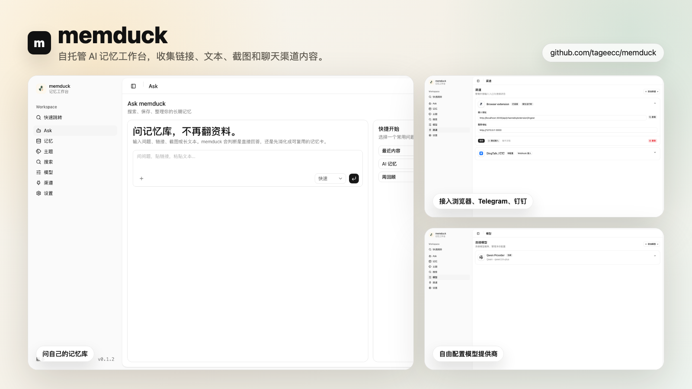

<div align="center">


# memduck

**自托管 AI 记忆工作区：保存链接、文本、截图和聊天渠道消息**

[](https://github.com/tageecc/memduck/blob/main/LICENSE)
[](https://github.com/tageecc/memduck/stargazers)
[](https://www.npmjs.com/package/memduck)

[快速开始](#快速开始) · [核心功能](#核心功能) · [工作原理](#工作原理) · [文档](#文档)

[English](./README.md) | **简体中文**

</div>

---

## 截图

<div align="center">
  
  <p><em>问自己的记忆库，从浏览器和聊天渠道捕获资料，并自由配置模型提供商。</em></p>
</div>

---

## 为什么做 memduck

真正有用的上下文经常散落在浏览器标签、临时复制的文本、截图、Telegram 消息和团队聊天里。memduck 的目标是把这些材料变成一个本地记忆工作区：保存一次，之后直接提问，并能追溯回原始来源。

它更适合开发者、研究者、独立创作者，以及希望自己掌控数据、模型 provider 和渠道连接的人。

---

## 核心功能

- **记忆卡片** — 保存链接、文本、截图和渠道消息，并保留来源追溯。
- **引用式问答** — 只基于已保存资料回答，并给出引用来源。
- **自托管运行时** — 本地运行 Next.js 工作区，使用 SQLite 和本地文件资产。
- **浏览器捕获** — 通过 Manifest V3 插件捕获当前页面或选中文本。
- **渠道中心** — 配置 Web、浏览器插件、Telegram、钉钉、Slack、Discord、飞书、WhatsApp 等入口。
- **模型提供商目录** — 选择 OpenAI、Anthropic、Gemini、Ollama、OpenAI-compatible profiles 和更多 provider preset。
- **后台编译** — 在渲染路径之外生成主题、摘要、embedding、复习队列和检索数据。

---

## 快速开始

### 从 npm 安装

```bash
npm install -g memduck@latest
memduck
```

同时启动 Web 运行时和 Telegram：

```bash
memduck --with-telegram
```

打包后的运行时默认把配置和 SQLite 状态保存在 `~/.memduck`。

### 从源码运行

**前置要求**

- Node.js 24+
- [pnpm](https://pnpm.io)

```bash
git clone https://github.com/tageecc/memduck.git
cd memduck
pnpm install
pnpm memduck dev
```

同时启动 Web、后台 worker 和 Telegram bot：

```bash
pnpm memduck dev --with-telegram
```

打开 [http://127.0.0.1:3000/ask](http://127.0.0.1:3000/ask) 开始使用。

打开浏览器前，可以先做一次本地就绪检查：

```bash
pnpm memduck doctor
```

如果你想把运行时数据放到其他目录，可以设置 `MEMDUCK_HOME`。

---

## 功能细节

<details>
<summary><strong>捕获与导入</strong></summary>

<br/>

- 保存 URL、粘贴文本、截图和聊天/渠道消息。
- 保留原始内容，让摘要和回答都能追溯来源。
- 通过浏览器插件把当前页面或选中文本发送到 `/api/ingest`。
- 原生渠道和 webhook adapter 复用同一套 ingestion API。

</details>

<details>
<summary><strong>AI 记忆检索</strong></summary>

<br/>

- 当当前 provider profile 包含 embedding 模型时，自动处理可检索卡片。
- 对原始文本切块，让引用可以指向原始片段。
- 对保存卡片做语义检索，并在回答前重排候选内容。
- 持久化主题关联、置信度和推理原因，方便解释分组来源。

</details>

<details>
<summary><strong>渠道</strong></summary>

<br/>

- 原生本地运行时：Web、浏览器插件、Telegram。
- Webhook 导入适配器：钉钉、Slack、Discord、飞书、WhatsApp。
- 参考 OpenClaw 风格的渠道目录，用于配置和追踪更多渠道选项。
- `/channels` 中展示运行时诊断和 heartbeat 状态。

</details>

<details>
<summary><strong>模型提供商</strong></summary>

<br/>

- 内置 provider library，参考 OpenClaw 风格的 provider catalog。
- 支持 OpenAI、Anthropic、Gemini、Ollama、OpenAI-compatible profiles 和其他本地/托管 provider。
- 可以为当前运行时激活一个 provider profile。
- 使用检索或聊天前，可以先在 Web UI 中测试 provider 是否可用。

</details>

<details>
<summary><strong>复习与知识编译</strong></summary>

<br/>

- 后台 worker 编译主题摘要和复习队列。
- 用户可以 star、highlight，并把卡片加入复习。
- 记忆权重通过显式信号展示，而不是只依赖隐藏排序。
- 主题和复习数据会服务检索和记忆详情页。

</details>

---

## 工作原理

```text
┌──────────────────┐     ┌──────────────────┐     ┌──────────────────┐
│ 浏览器 / 聊天渠道 │────▶│    导入 API       │────▶│ SQLite + 文件资产 │
└──────────────────┘     └──────────────────┘     └──────────────────┘
          │                        │                        │
          ▼                        ▼                        ▼
┌──────────────────┐     ┌──────────────────┐     ┌──────────────────┐
│    渠道中心       │     │   编译 Worker     │────▶│ Embedding / 主题  │
└──────────────────┘     └──────────────────┘     └──────────────────┘
                                   │                        │
                                   ▼                        ▼
                         ┌──────────────────┐     ┌──────────────────┐
                         │    Ask Agent     │────▶│    引用式回答     │
                         └──────────────────┘     └──────────────────┘
```

1. **捕获** — 浏览器插件、Telegram、钉钉、Slack、Discord、飞书、WhatsApp 和 Web 输入都会进入同一个本地 API。
2. **归一化** — memduck 保存原始来源、卡片摘要、本地资产、provider 设置和渠道状态。
3. **编译** — worker 在后台生成 embedding、主题关联、主题摘要和复习队列。
4. **提问** — Agent 检索相关记忆、重排候选内容，并引用保存过的来源回答。

---

## 产品地图

- `/ask` — 提问工作区，用于问题、链接、文本、截图和记忆创建。
- `/inbox` — 已保存记忆卡片库。
- `/memory/:id` — 记忆详情页，包含信号操作和来源追溯。
- `/models` — Provider 和模型配置。
- `/channels` — Web、插件、Telegram、钉钉、Slack、Discord、飞书、WhatsApp 和 catalog 渠道配置。
- `/setup` — 语言和主题偏好。

---

## 技术栈

| 层级 | 技术 |
|------|------|
| Web App | Next.js 16, React 19, TypeScript |
| UI | Tailwind CSS, shadcn/ui, Radix UI, lucide-react |
| AI SDK | Vercel AI SDK, Streamdown |
| 存储 | SQLite, better-sqlite3, 本地文件资产 |
| 渠道 | Manifest V3 extension, grammY Telegram bot, webhook adapters |
| 运行时 | Node.js 24+, packaged CLI |
| 测试 | Vitest, TypeScript, Biome |

---

## 浏览器插件

构建未打包插件：

```bash
pnpm extension:build
```

在 Chrome 中加载 `extension/dist`。插件弹窗可以设置本地 app URL，并把当前页面或选中文本发送到 `/api/ingest`。

---

## Telegram 与渠道适配器

在 `/channels` 保存 Telegram bot token，或设置 `TELEGRAM_BOT_TOKEN`，然后运行：

```bash
memduck --with-telegram
```

Telegram 和浏览器插件是原生本地运行时。钉钉、Slack、Discord、飞书和 WhatsApp 使用 webhook 导入适配器。

---

## CLI

| 命令 | 说明 |
|------|------|
| `memduck` | 创建本地运行时状态，启动打包后的 Web server 和 worker，然后打开 dashboard。 |
| `memduck --with-telegram` | 同时启动 Web、worker 和 Telegram。 |
| `memduck doctor` | 检查本地运行时、provider 和 Telegram 就绪状态。 |
| `pnpm memduck dev` | 从源码启动 Next.js 和后台编译 worker。 |
| `pnpm memduck dev --with-telegram` | 从源码同时启动 Web、worker 和 Telegram bot。 |
| `pnpm worker:dev` | 只运行知识编译 worker。 |
| `pnpm check` | 运行 lint、typecheck、tests、extension build、CLI build 和生产构建。 |

---

## 文档

- [English README](README.md)
- [中文 PRD](docs/prd.zh-CN.md)
- [简化 MVP 架构](docs/architecture.zh-CN.md)
- [开源发布检查清单](docs/open-source-release-checklist.md)
- [贡献指南](CONTRIBUTING.md)
- [安全策略](SECURITY.md)
- [行为准则](CODE_OF_CONDUCT.md)
- [许可证](LICENSE)

---

## 支持项目

如果 memduck 对你有帮助，欢迎给仓库点一个 Star。它会让更多需要自托管和 local-first AI 记忆工具的人看到这个项目。
